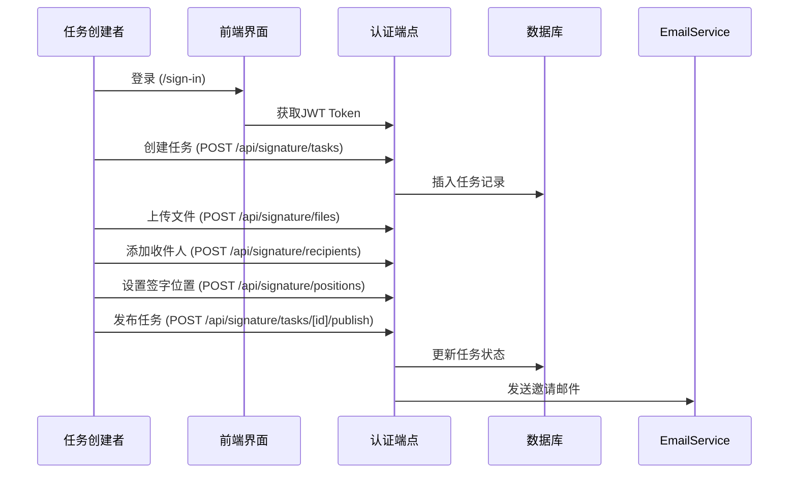
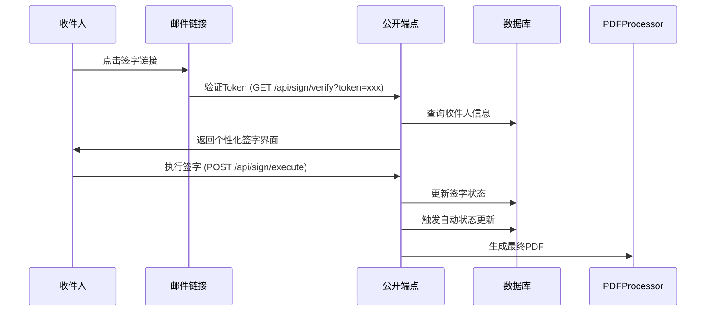

# 电子签字系统后端架构文档

## 📋 概览

本文档详细描述了电子签字系统的完整后端架构，基于 Next.js App Router 构建，支持双重认证模式和一键签字功能。

### 🏗️ 核心架构设计

```
电子签字系统后端架构
├── 前端认证页面 (已存在)
│   ├── /sign-in/[[...sign-in]]/page.tsx
│   └── /sign-up/[[...sign-up]]/page.tsx
├── 后端API端点 (新创建)
│   ├── /api/signature/* (认证端点)
│   ├── /api/sign/* (公开端点)
│   └── /api/auth/* (认证工具)
└── 支持工具模块 (新创建)
    ├── 认证模块
    ├── 邮件模块
    ├── PDF处理模块
    ├── 签字模块
    └── 数据库模块
```

### 🔐 认证架构

#### 双重认证模式
1. **任务创建者认证** - Clerk JWT认证系统
2. **收件人Token访问** - 基于Token的无需登录访问

#### 认证流程
- **任务创建者**：登录 → 获取JWT → 访问 `/api/signature/*` 端点
- **收件人**：收到邮件 → 点击Token链接 → 访问 `/api/sign/*` 端点

---

## 📁 API端点架构

### 🔒 认证端点 (`/api/signature/*`)

> **认证要求**：需要有效的 Clerk JWT Token  
> **目标用户**：任务创建者  
> **功能范围**：完整的签字任务管理

#### 任务管理端点
```
📂 src/app/api/signature/tasks/
├── route.ts                    # 任务列表管理
│   ├── GET  /api/signature/tasks      # 获取用户所有任务
│   └── POST /api/signature/tasks      # 创建新任务
└── [id]/
    ├── route.ts                # 任务详情管理
    │   ├── GET    /api/signature/tasks/[id]        # 获取任务详情
    │   ├── PUT    /api/signature/tasks/[id]        # 更新任务信息
    │   └── DELETE /api/signature/tasks/[id]        # 删除任务
    └── publish/
        └── route.ts            # 任务发布
            └── POST /api/signature/tasks/[id]/publish  # 发布任务并发送邮件
```

#### 文件管理端点
```
📂 src/app/api/signature/files/
├── route.ts                    # 文件列表管理
│   ├── GET  /api/signature/files      # 获取用户所有文件
│   └── POST /api/signature/files      # 上传新文件
└── [id]/
    └── route.ts                # 文件详情管理
        ├── GET    /api/signature/files/[id]        # 获取文件详情
        ├── PUT    /api/signature/files/[id]        # 更新文件元数据
        └── DELETE /api/signature/files/[id]        # 删除文件
```

#### 收件人管理端点
```
📂 src/app/api/signature/recipients/
├── route.ts                    # 收件人列表管理
│   └── POST /api/signature/recipients  # 添加收件人到任务
└── [id]/
    └── route.ts                # 收件人详情管理
        ├── GET    /api/signature/recipients/[id]   # 获取收件人详情
        ├── PUT    /api/signature/recipients/[id]   # 更新收件人信息
        └── DELETE /api/signature/recipients/[id]   # 删除收件人
```

#### 签字位置管理端点
```
📂 src/app/api/signature/positions/
├── route.ts                    # 位置列表管理
│   └── POST /api/signature/positions   # 添加签字位置到文件
└── [id]/
    └── route.ts                # 位置详情管理
        ├── GET    /api/signature/positions/[id]    # 获取位置详情
        ├── PUT    /api/signature/positions/[id]    # 更新位置信息
        └── DELETE /api/signature/positions/[id]    # 删除位置
```

#### 邮件服务端点
```
📂 src/app/api/signature/email/
├── send/
│   └── route.ts                # 邮件发送
│       └── POST /api/signature/email/send      # 发送签字邀请邮件
└── resend/
    └── route.ts                # 邮件重发
        └── POST /api/signature/email/resend    # 重发签字邀请邮件
```

#### PDF处理端点
```
📂 src/app/api/signature/pdf/
├── generate/
│   └── route.ts                # PDF生成
│       └── POST /api/signature/pdf/generate    # 生成最终签字PDF
└── download/
    └── route.ts                # PDF下载
        └── GET /api/signature/pdf/download     # 下载已签字PDF
```

#### 系统管理端点
```
📂 src/app/api/signature/
├── status/
│   └── route.ts                # 状态管理
│       └── GET /api/signature/status           # 获取任务状态概览
└── webhooks/
    └── route.ts                # Webhook处理
        └── POST /api/signature/webhooks        # 处理外部系统通知
```

---

### 🌐 公开端点 (`/api/sign/*`)

> **认证要求**：基于Token验证，无需用户登录  
> **目标用户**：签字收件人  
> **功能范围**：签字相关操作

```
📂 src/app/api/sign/
├── verify/
│   └── route.ts                # Token验证
│       └── GET /api/sign/verify?token=xxx      # 验证Token并获取签字界面
├── execute/
│   └── route.ts                # 执行签字
│       └── POST /api/sign/execute              # 执行一键签字操作
└── status/
    └── route.ts                # 签字状态
        └── GET /api/sign/status?token=xxx      # 检查签字进度
```

---

### 🔑 认证工具端点 (`/api/auth/*`)

> **认证要求**：根据具体端点而定  
> **目标用户**：系统认证验证  
> **功能范围**：认证状态管理

```
📂 src/app/api/auth/
└── validate/
    └── route.ts                # 认证验证
        └── POST /api/auth/validate             # 验证用户认证状态
```

---

## 🛠️ 支持工具模块

### 🔐 认证模块 (`src/lib/auth/`)

```
📂 src/lib/auth/
├── middleware.ts               # Clerk JWT验证中间件
│   ├── 验证Authorization头中的JWT Token
│   ├── 提取用户信息
│   ├── 处理认证错误
│   └── 权限验证
└── token-validator.ts          # 收件人Token验证工具
    ├── 验证Token有效性
    ├── 检查Token过期状态
    ├── 获取Token关联的收件人信息
    └── 验证收件人权限
```

### 📧 邮件模块 (`src/lib/email/`)

```
📂 src/lib/email/
├── resend-client.ts            # Resend邮件客户端
│   ├── 配置Resend API客户端
│   ├── 发送邮件功能
│   ├── 邮件投递状态跟踪
│   └── 错误处理
└── templates.ts                # 邮件HTML模板
    ├── 签字邀请邮件模板
    ├── 签字确认通知模板
    ├── 任务完成通知模板
    └── 模板变量处理
```

### 📄 PDF处理模块 (`src/lib/pdf/`)

```
📂 src/lib/pdf/
└── processor.ts                # PDF生成和处理
    ├── 读取原始PDF文件
    ├── 坐标系统转换（百分比 ↔ 像素）
    ├── 嵌入签字内容到PDF
    ├── 生成最终签字PDF
    └── PDF文件存储管理
```

### ✍️ 签字模块 (`src/lib/signature/`)

```
📂 src/lib/signature/
└── generator.ts                # 固定格式签字生成器
    ├── 生成签字内容：【{姓名}】signed at【{时间}】
    ├── 艺术字体样式处理
    ├── 签字图标生成
    ├── 签字格式验证
    └── 签字内容国际化
```

### 🗄️ 数据库模块 (`src/lib/database/`)

```
📂 src/lib/database/
└── queries.ts                  # 数据库查询操作
    ├── 任务相关查询（CRUD）
    ├── 文件相关查询（CRUD）
    ├── 收件人相关查询（CRUD）
    ├── 签字位置相关查询（CRUD）
    ├── 状态更新查询
    ├── 聚合统计查询
    └── 事务处理
```

---

## 🔄 数据流架构

### 任务创建者工作流



### 收件人签字工作流



---

## 🚀 开发实施指南

### 第一阶段：核心认证
1. **实现认证中间件** (`src/lib/auth/middleware.ts`)
   - 集成Clerk JWT验证
   - 设置权限检查
   - 处理认证错误

2. **实现Token验证** (`src/lib/auth/token-validator.ts`)
   - 创建Token生成逻辑
   - 实现Token验证机制
   - 处理过期和安全

### 第二阶段：数据库操作
1. **实现数据库查询** (`src/lib/database/queries.ts`)
   - 基础CRUD操作
   - 复杂联合查询
   - 事务处理

2. **实现核心API端点**
   - 任务管理 (`/api/signature/tasks/*`)
   - 文件管理 (`/api/signature/files/*`)
   - 收件人管理 (`/api/signature/recipients/*`)

### 第三阶段：签字功能
1. **实现签字生成器** (`src/lib/signature/generator.ts`)
   - 固定格式签字生成
   - 艺术字体处理

2. **实现公开签字端点** (`/api/sign/*`)
   - Token验证端点
   - 签字执行端点
   - 状态查询端点

### 第四阶段：邮件和PDF
1. **实现邮件系统** (`src/lib/email/*`)
   - Resend客户端配置
   - 邮件模板创建
   - 邮件发送端点

2. **实现PDF处理** (`src/lib/pdf/processor.ts`)
   - PDF生成逻辑
   - 坐标系统转换
   - 签字嵌入功能

### 第五阶段：高级功能
1. **实现Webhook处理** (`/api/signature/webhooks`)
2. **实现状态管理** (`/api/signature/status`)
3. **实现PDF下载** (`/api/signature/pdf/download`)

---

## 🛡️ 安全考虑

### 认证安全
- **JWT Token验证**：所有认证端点必须验证Clerk JWT
- **Token过期处理**：收件人Token应有合理过期时间
- **权限验证**：确保用户只能访问自己的资源

### 数据安全
- **输入验证**：所有API端点需要严格的输入验证
- **SQL注入防护**：使用参数化查询
- **敏感信息保护**：避免在响应中暴露敏感数据

### 文件安全
- **文件类型验证**：只允许PDF文件上传
- **文件大小限制**：设置合理的文件大小限制
- **存储权限**：确保文件存储的访问权限正确

---

## 📊 性能优化

### 数据库优化
- **查询优化**：使用适当的索引和查询优化
- **连接池管理**：合理配置数据库连接池
- **缓存策略**：对常用数据实施缓存

### API性能
- **响应时间**：监控API响应时间
- **并发处理**：处理高并发请求
- **错误重试**：实现适当的错误重试机制

### 文件处理
- **异步处理**：PDF生成使用异步队列
- **存储优化**：优化文件存储和访问
- **CDN集成**：考虑CDN加速文件访问

---

## 🧪 测试策略

### 单元测试
- **API端点测试**：测试所有API端点的功能
- **工具函数测试**：测试所有lib工具函数
- **认证测试**：测试认证和权限逻辑

### 集成测试
- **工作流测试**：测试完整的签字工作流
- **邮件集成测试**：测试邮件发送和接收
- **PDF生成测试**：测试PDF生成和处理

### 端到端测试
- **用户体验测试**：测试完整的用户体验流程
- **多设备测试**：测试移动端和桌面端
- **性能测试**：测试系统性能和负载能力

---

## 📝 总结

该架构提供了：
- ✅ **完整的文件结构**：所有必要的API端点和工具模块
- ✅ **双重认证模式**：支持任务创建者和收件人的不同认证需求
- ✅ **模块化设计**：清晰的功能分离和代码组织
- ✅ **可扩展性**：易于添加新功能和集成第三方服务
- ✅ **安全性**：完善的认证和权限控制机制

现在您可以根据这个架构文档开始实施具体的功能代码，每个文件都有明确的职责和接口定义。 